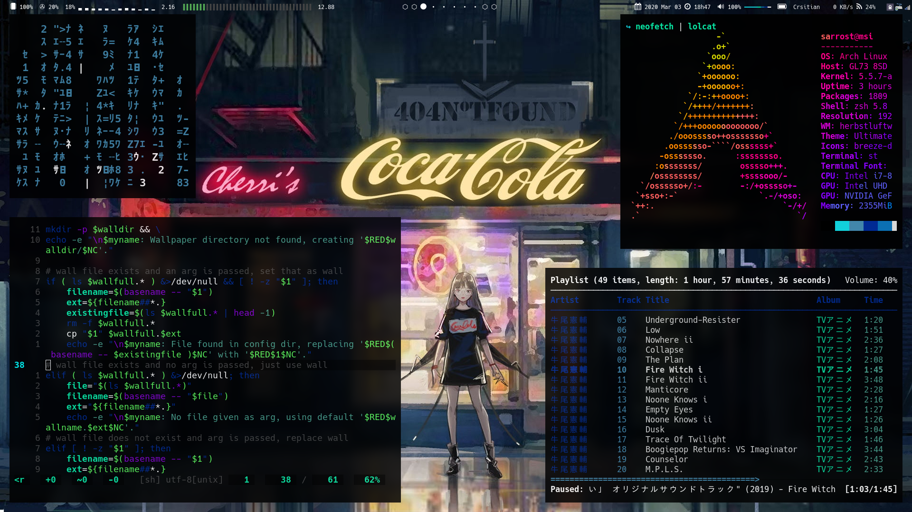

# rice

A script that auto-installs a personally customized desktop environment. The script only works for gentoo linux at the moment.



Wallpaper: [xx](xx) by [yy](yy)

## Usage

```
	curl 'https://raw.githubusercontent.com/sarrost/rice/master/rice/rice.sh' -o rice.sh
	chmod +x rice.sh
	sh rice.sh
```

**Note:** Two files `rice.stage` and `rice.log` will be created in `~/.cache`. Do not remove these files, they will be removed once installation is complete. They are responsible for keeping track of the current install stage and maintaining a simple log respectively.

## Why does this exist?

I made this script for my own convenience. I provide essentially no documentation as to how to use my setup. I have hundreds of custom shortcuts that do a hundred different things, therefore this setup is unusable to anyone who does not know the shortcuts. I do not expect anyone to actually run this script verbatim. I share this as an example for those who would like to make something similar.

## Features

The script is simple and will allow installation in steps. My desktop environment has been built from the foundation up, that is no KDE, XFCE, UNITY, etc. It consists of only a tiling window manager, all the individual programs I use, and some useful scripts I've written and ~stolen~ borrowed. The programs are configured through configuration files, sometimes referred to as dotfiles.

The script will download software from the official repository of the distribution/OS and some other software straight from source. It will also download, install, and configure from some of my other personal repos. Those repos being:

- [dotfiles](dotfiles) -- My personal system configuration files for linux
- [scripts](scripts) -- My personal scripts that I use for everyday tasks

- [st](st) -- My personal build of st (simple terminal for X)
- [dwm](dwm) -- My personal build of dwm (dynamic window manager for X)
- [dwmblocks](dwmblocks) -- My personal build of dwmblocks, a status bar for dwm
- [dmenu](dmenu) -- My personal build of dmenu (dynamic menu for X)

## Contact

Feel free to contact me at `herbert@magaya.co.za` if you have any questions. Thank you and have a nice day.
